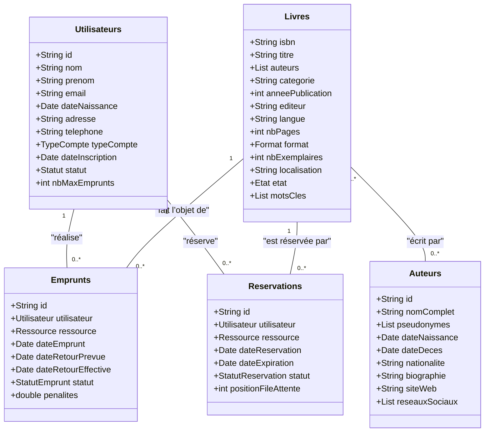

# alexandrie-2.0
**schema de projet**

**pour quoi on a choisi PostgreSQL**

PostgreSQL garantit une structure de données bien définie, idéale pour gérer des entités relationnelles comme les livres, les emprunts et les utilisateurs.

Il offre une forte cohérence et un respect strict des contraintes, ce qui évite les incohérences dans les données sensibles (ex. : disponibilité des livres).

Ses capacités SQL avancées facilitent les requêtes complexes, souvent nécessaires pour la recherche de livres, les statistiques d’emprunts ou la gestion des réservations.
